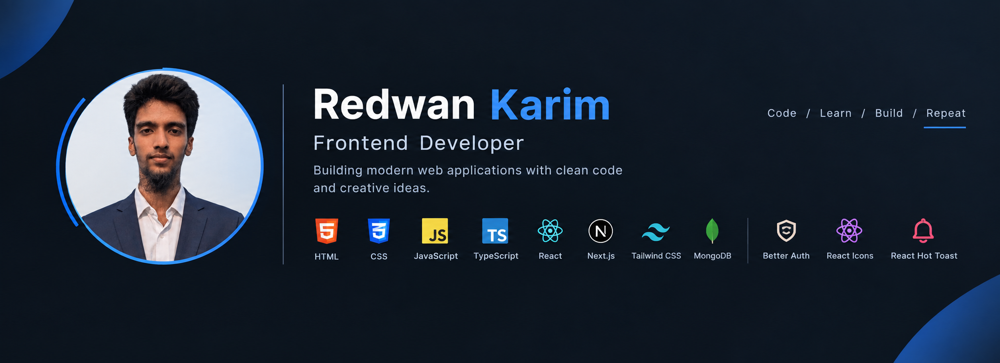

<!-- Profile Banner -->

  

 

<!-- Introduction -->

<h1 align="center">Redwan Karim</h1>

  Frontend Developer | React | Next.js | TypeScript

  Building modern, responsive and user-friendly web applications
  with clean and maintainable code.

---

## About Me

I am a frontend developer passionate about building modern web applications and continuously improving my development skills.

I enjoy turning ideas into real-world projects and learning new technologies through hands-on development.

Currently, I am focusing on React, Next.js, TypeScript, authentication, APIs and database integration.

- Frontend development
- Responsive web design
- React and Next.js development
- TypeScript
- REST API integration
- Authentication with Better Auth
- MongoDB
- Reusable and maintainable components
- Modern UI development

---

## Technologies I Work With

### Frontend

  

### Database

  

### Development Tools

  

### Libraries & Other Technologies

---

## My Learning Journey

&nbsp;&nbsp;→&nbsp;&nbsp;

&nbsp;&nbsp;→&nbsp;&nbsp;

&nbsp;&nbsp;→&nbsp;&nbsp;

&nbsp;&nbsp;→&nbsp;&nbsp;

&nbsp;&nbsp;→&nbsp;&nbsp;

&nbsp;&nbsp;→&nbsp;&nbsp;

---

## Featured Projects

### Book Vibe

A modern book discovery application built with Next.js and TypeScript.

Users can explore books, view book details, manage reading lists and organize their reading experience.

**Technologies**

`Next.js` `TypeScript` `Tailwind CSS` `DaisyUI` `Context API`

---

### Fit Log

A workout tracking application where users can explore workouts, create a daily workout plan, save workouts for later and track completed exercises.

**Technologies**

`Next.js` `TypeScript` `Tailwind CSS` `Context API` `React Hot Toast`

---

### DevStack

A developer technology stack management application where users can explore technologies and add them to their personal stack.

**Technologies**

`React` `TypeScript` `Tailwind CSS` `React Icons`

---

## Currently Learning

- Advanced React
- Next.js
- TypeScript
- Better Auth
- MongoDB
- REST APIs
- Authentication and Authorization
- Full-stack development
- Modern UI development
- Clean and reusable code

---

## GitHub Statistics

  

  

  

---

## What I Am Working Towards

- Becoming a strong frontend developer
- Mastering React and Next.js
- Improving TypeScript skills
- Building full-stack applications
- Learning authentication and authorization
- Working with MongoDB and APIs
- Building more real-world projects
- Improving problem-solving skills
- Writing clean and maintainable code

---

## Connect With Me

---

<h3 align="center">
  Code · Learn · Build · Repeat
</h3>

  Thanks for visiting my profile.

